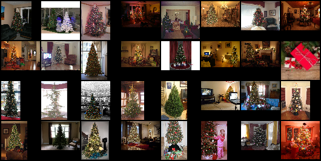
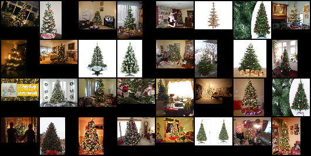
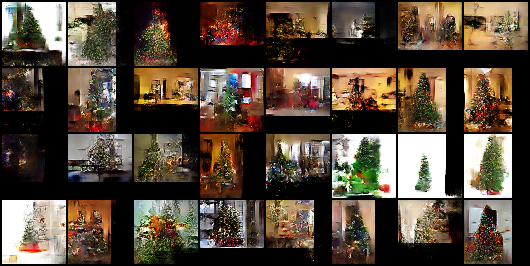
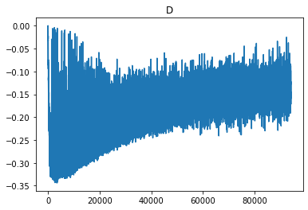
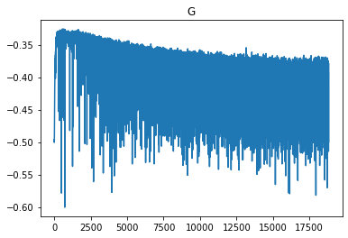

# GAN_christmass_tree_generator

[Google Colab link](https://colab.research.google.com/drive/101mA97Hfx15FZJLsNwTq7F4WRpE546OL?usp=sharing)

[data](https://drive.google.com/file/d/1o03SwxJVVhRnsn245hphj5GqEF5sjOZD/view?usp=sharing)

code is using [DCGAN](https://arxiv.org/pdf/1511.06434.pdf) and [Wasserstain GAN](https://arxiv.org/pdf/1701.07875.pdf)

## real

## fake

## loss

